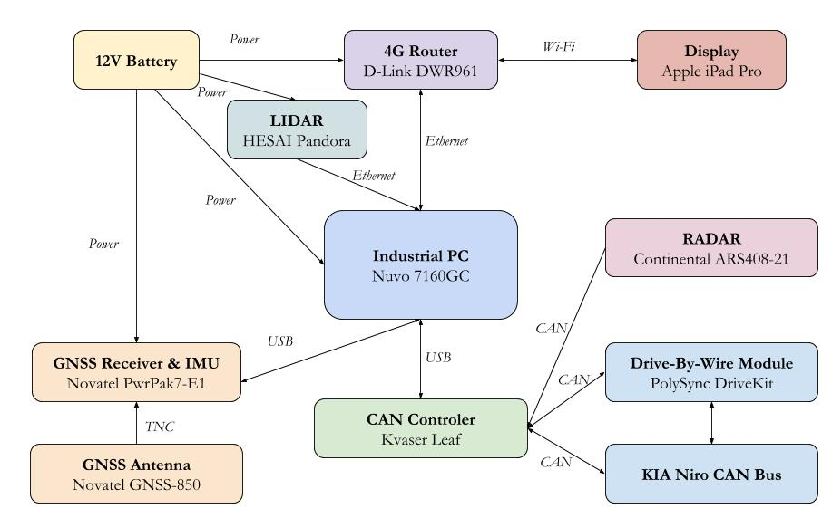
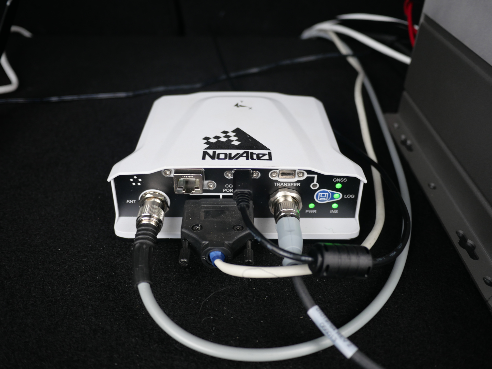
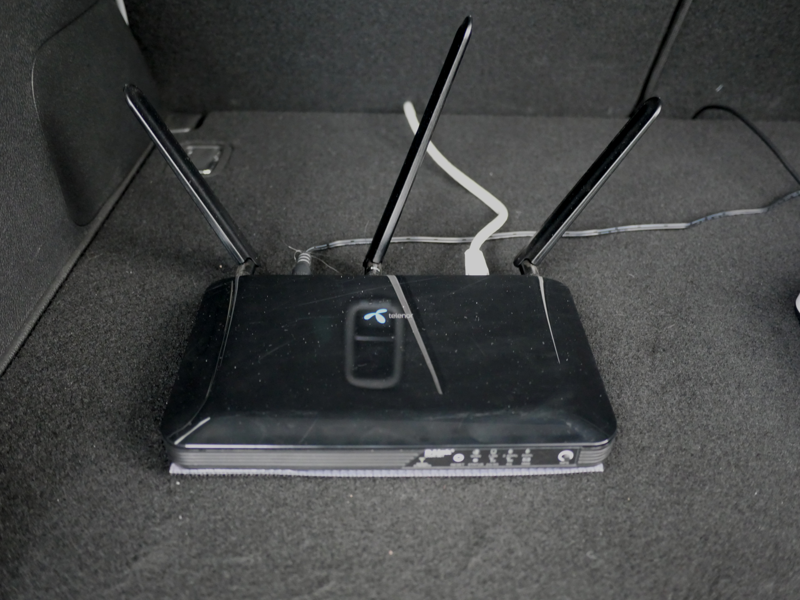
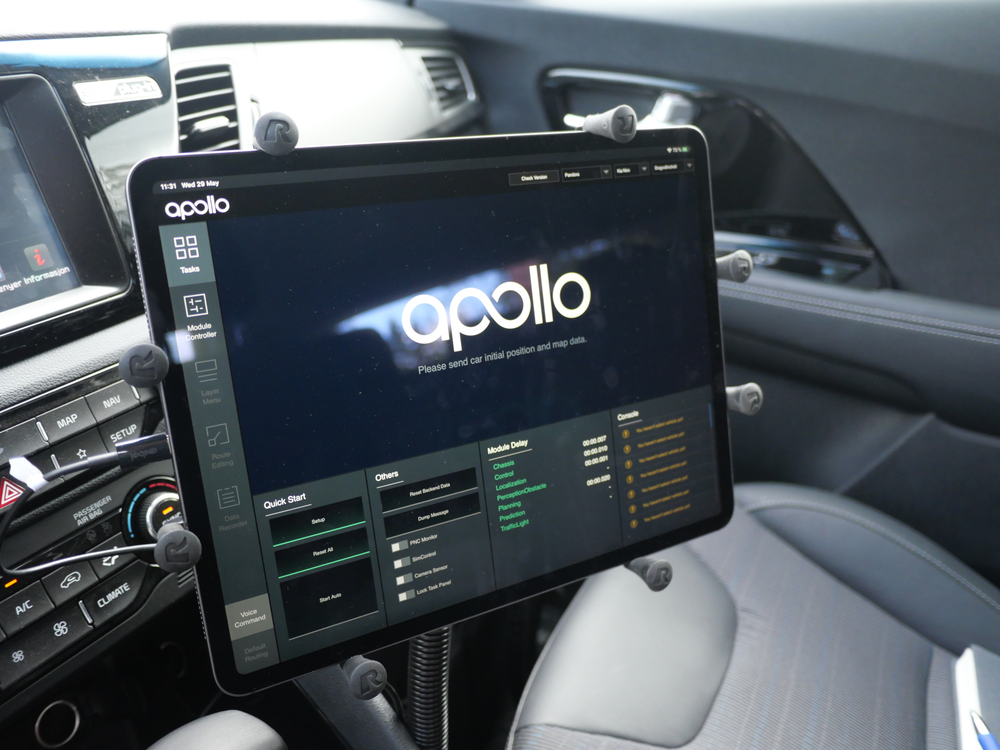
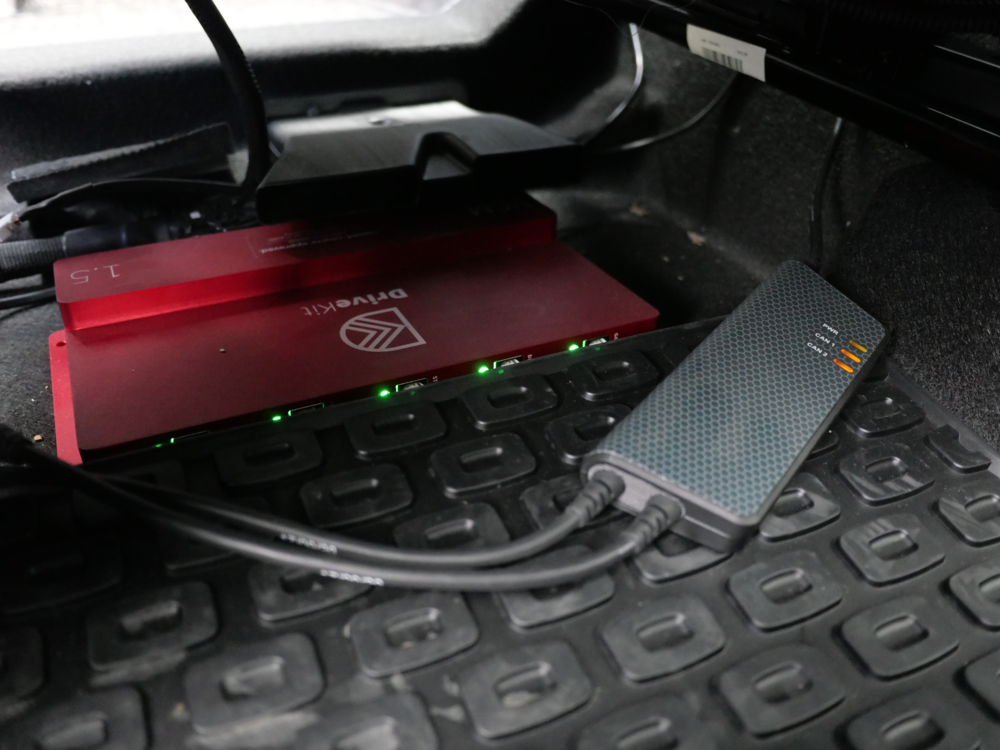
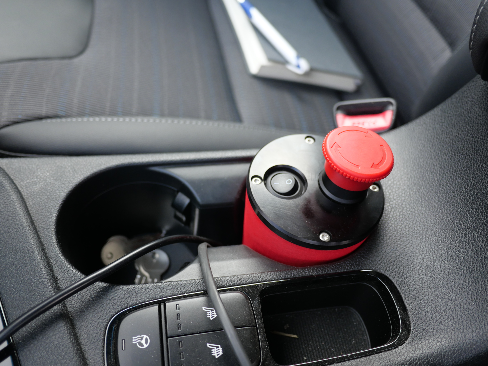
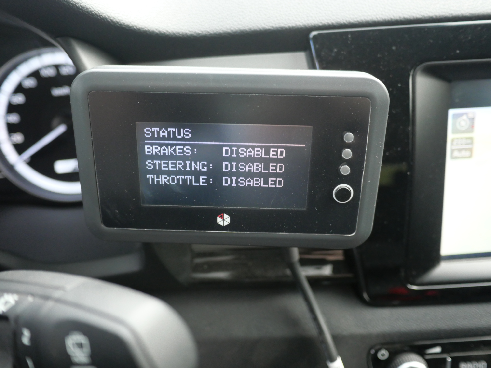
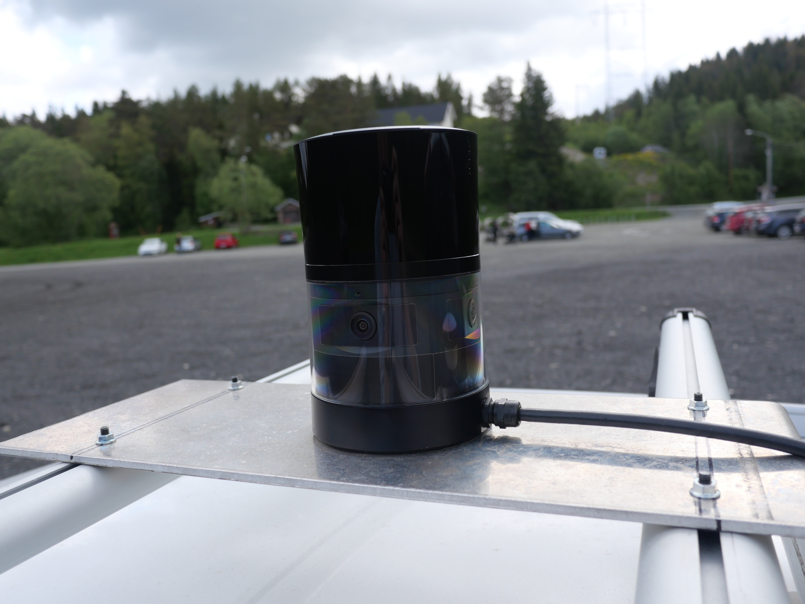
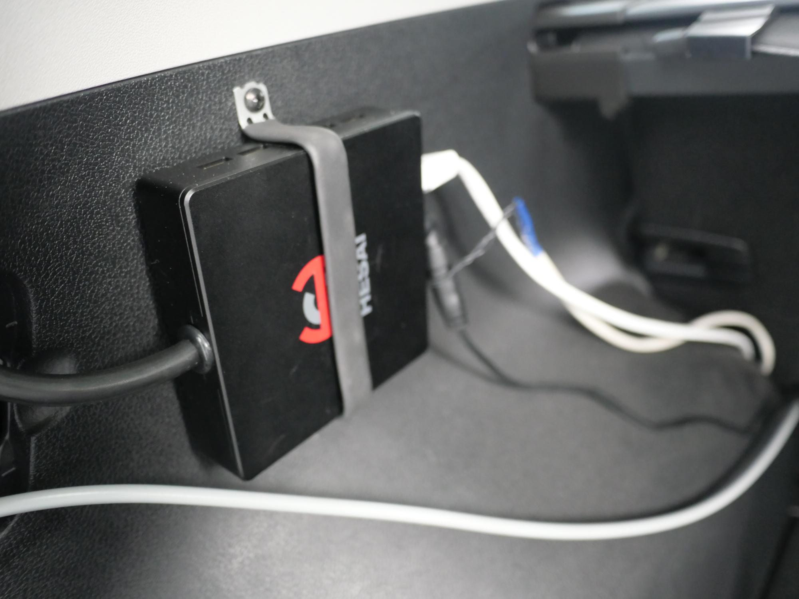
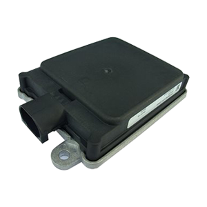

# Electronic Platform

## Architecture

A summary of the components and their connections is provided in the diagram below.

## Battery

The car has a 12V battery hidden in the right side of its trunk. This battery has been equipped with a power socket, a digital display and a set of wires by the KIA garage in Trondheim \([BOS](https://www.bos.no/)\). The power socket, located near the license plate, can be connected with the green cable stored under the trunk to a wall plug. The display is a voltmeter that allows to check the status of battery charging. The wires go to a set of connectors equipped with breakers and provide power supply to the components used in the car. It is recommended to always operate the car while its engine is running \(key turned all the way to the right\) to avoid running out of battery.

## Industrial PC \(IPC\)

The computer running our autonomous driving stack is a Nuvo 7160GC. This computer embeds a NVIDIA GTX 1060 graphic card for DNN inference.

It is configured \(more details in the Software section\) in such a way that the leftmost ethernet port should be connected to the LIDAR \(black ethernet cable\) and the rightmost ethernet port should be connected to the 4G router \(blue ethernet cable\). It is also connected to both the drive-by-wire system and to the INS system via USB. When used outside the car, in the lab, the rightmost ethernet cable can be plugged to the wall.

## Inertial Navigation System \(INS\)

For precise positioning, the car embeds an Inertial Navigation System \(INS\) which fuses data from an Inertial Measurement Unit \(IMU\) and a GNSS receiver \(GPS or GLONASS or BeiDou or Galileo\). The INS system is a Novatel PwrPak 7-E1 and embeds an Epson G320N IMU. It is connected to a Novatel GNSS-850 antenna placed on the roof via a long gray coaxial cable. To achieve centimeter accuracy the GNSS positioning is not as simple as a NavSat receiver as found in a mobile phone, it is coupled with a carrier-phase enhancement system by an RTK algorithm. \(more details on the NTRIP server in the Software section\).

The PwrPak7-E1 emits a Wi-Fi network with a captive portal that can be used to investigate the current status of GNSS reception and ports.

The PwrPak7 comes with a COM connector that exposes a lot of pins. It is [documented online by Novatel](https://docs.novatel.com/OEM7/Content/Technical_Specs_Receiver/PwrPak7_Connectors.htm). Among the pins exposed by this COM interface, Novatel provides RS232 serial lines. Novatel provides a cable that allows to connect a computer to the COM port over a DB9 serial connection, but we do not use this cable because we need other pins.

We assembled our own COM cable with the soldering help of TrollLabs. Our cable connects some of the pin in the PwrPak7’s HD26 COM port to some of the pins of the SM06B-SRSS-TB of the LIDAR. This exposes a PPS signal and a RS232 line for GPRMC data for time synchronization. \(more details on the use of time synchronization in the Software section\) A description of this cable is documented in a pdf stored in the lab's SharePoint.

Novatel also provides a power cable which exposes two wires to be connected to a 12V battery. We simply soldered those pins to connectors that fit our installation.

The communication between the PwrPak7 and the IPC is done over a simple micro-USB cable typically found in consumer-electronics applicances.

## 4G Router

In order to provide Internet connectivity, the car has a 4G router obtained as part of a partnership with Telenor. This model is a [D-Link DWR961](https://nettbutikk.telenor.no/mobilt-bredbaand/router-aksesspunkt/d-link-ruter-4gplus-dwr961/svart/). Telenor also provided a SIM with unlimited data whose PIN code is 8007.

This router exposes its connection to the Internet over a Wi-Fi network whose SSID is "_Telenor4G\_C878FF_". It can be configured over a web interface accessible at the address _192.168.1.1_.

The router has been configured to assign a static IP to the IPC, based on its mac address. The IPC uses DHCP but is always assigned the address _192.168.1.50_.

## Tablet

To control the IPC from inside the car’s cockpit, a tablet is installed near the driver seat. The tablet is an iPad Pro 2019. It has an SSH app installed, preconfigured to connect to the IPC IP \(_192.168.1.50_\). It also has a home-screen shortcut to the autonomous driving interface exposed by the IPC, DreamView. \(more details on DreamView in the software section\) The lab’s cupboard contains an Apple pen that can be used to control the tablet with precision.

## Drive-by-wire system

The car is equipped with a electronic control system designed by [PolySync](https://polysync.io/) and installed by the KIA garage in Trondheim. This system is called [DriveKit](https://polysync.io/drivekit) and allows to control the car’s steering wheel, brake pedal, throttle pedal and other things such as horn, turn signals, wipers, VIN and headlamps.

The DriveKit is built upon the basis of [the Open-Source Car Control \(OSCC\) project](https://github.com/PolySync/oscc/). OSCC is split across three components: the hardware part \(contains PCB designs\), the firmware \(contains the code running inside the OSCC\) and the api \(a library usable from a Linux machine, abstracting the CAN frames into a set of C function\). \(more information about the API in the Software section\) The DriveKit is compatible with the OSCC stack but supports more CAN frames, such as the steering angle control command which is used by our autonomous driving stack.

The DriveKit main component is the “Vehicle Control Module” \(VCM\), the red box installed under the driver’s seat, this is where most processing happens. It is connected to various ECU in the car car thanks to the “Vehicle Control Harness” \(VCH\). The VCM exposes two DB9 CAN interfaces, one called “Vehicle CAN bus” and one called the “DriveKit CAN bus”. \(more details about the different frames transiting on those buses in the software section\) that are both connected to a KVaser USB-CAN controller, which is in turn connected to the IPC over USB. Note that USB is a token-based protocol and does not guarantee real time performance but the Vehicle Control Module ensures that frames are published at a constant rate to the car’s CAN buses. The VCM is alimented by a cable connected to one of the two front cigarette lighter receptacles, this cable has an integrated voltmeter.

The DriveKit also comes with a power module installed between the two front seats. Two buttons are found there, a power on-off button and an emergency “big red button” that immediately cuts the DriveKit power supply. For safety reason, every time the car is driven manually, the DriveKit should be off and everytime the car is driven autonomously, a safety co-pilot should keep a hand on the big red button.

Next to the steering wheel, the DriveKit has a small display that shows the current status of the DriveKit control modules. This display module has a button on the right that can be long-pressed to switch between two views; in the first \(default\) view, three different components can be enabled or disabled independently: Steering, Throttle and Brake. On the right side, LEDs show the status of those modes. If the green LED is on then all three modules are enabled. If the LED is red, then some modules might be disabled. The other mode allows to inspect DTC error codes reported by the car.

## Main LIDAR and cameras

Modern autonomous driving capabilities rely on a broad range of sensors. Two of the most important sensors used for autonomous driving are LIDARs and cameras. A LIDAR is essentially a set of rotating LASER emitters and receptors, measuring the distance it takes for light to travel forth and back and to deduce the distance of objects around the sensor. Cameras don’t need to be presented but it is important to note that in an autonomous driving context, industrial cameras are used, that have precisely known intrinsics and can be calibrated to cancel geometric distortion.

Our car uses the Pandora product of HESAI, a chinese company producing sensors for autonomous driving. The Pandora is made of an upper part which contains a Pandar40P LIDAR \(40 beams\) and a lower part which contains 5 cameras, four monochrome providing a 360 degrees view around the car and one front-facing RGB camera with a longer focal length, used to detect traffic lights. This tightly integrated system is very convenient because it provides precise data synchronisation, with camera exposures being triggered as the laser beams come across their azimuth.

The Pandora is screwed on top of the roof aluminium mount and has a cable going through the roof to the trunk. At the end of this cable can be found a connector box where all side connectors are unused and all front connectors are used. The rightmost port is connected to the power distribution. The leftmost connector is connected to the PwrPak7 through a home-made cable described in the INS section. The center port is an Ethernet port, used to connect the Pandora to the IPC.

The Pandora exposes a web interface at the address 192.168.20.51. This interface can be used to monitor the status of the unit \(ex: check the time synchronization status\).

The manual of the Pandora is stored in the lab's SharePoint.

## Secondary LIDAR

In addition to the HESAI Pandora, a secondary LIDAR from Velodyne, a popular american LIDAR manufacturer, is provided. The VLP16 is a entry-level LIDAR with 16 beams. It is either used for light acquisitions \(ex, on a tripod in the lab\) or in the context of HD Map data acquisition \(more details about it in the corresponding section\).

The VLP16 has a similar interface than the HESAI Pandora, with a GPS synchronization port, a power supply and an ethernet cable used to connect it to the IPC.

## RADARs

In addition to LIDARs and cameras, autonomous cars also embark lower-precision but cheaper and longer-range sensors which are kept at a low height and used to detect obstacles in the current lane: RADARs.

The lab has two Continental ARS408-21 RADARs which are industrial-grade RADAR that can be connected to a CAN bus. They are yet to be integrated to the KIA Niro front bumper.

## CAN debugging probe

Among the tools provided by PolySync as part of their DriveKit package is a CAN debugging probe called [Tryace](https://www.amazon.com/TryAce-Diagnostic-Universal-OBD2-Scanners/dp/B079GS91BG). It has to be connected to a power supply \(eg, a laptop\) via a mini-USB cable. It interfaces with the car using an OBD-II connector. The Tryace can be used to diagnostic DTC error codes.

