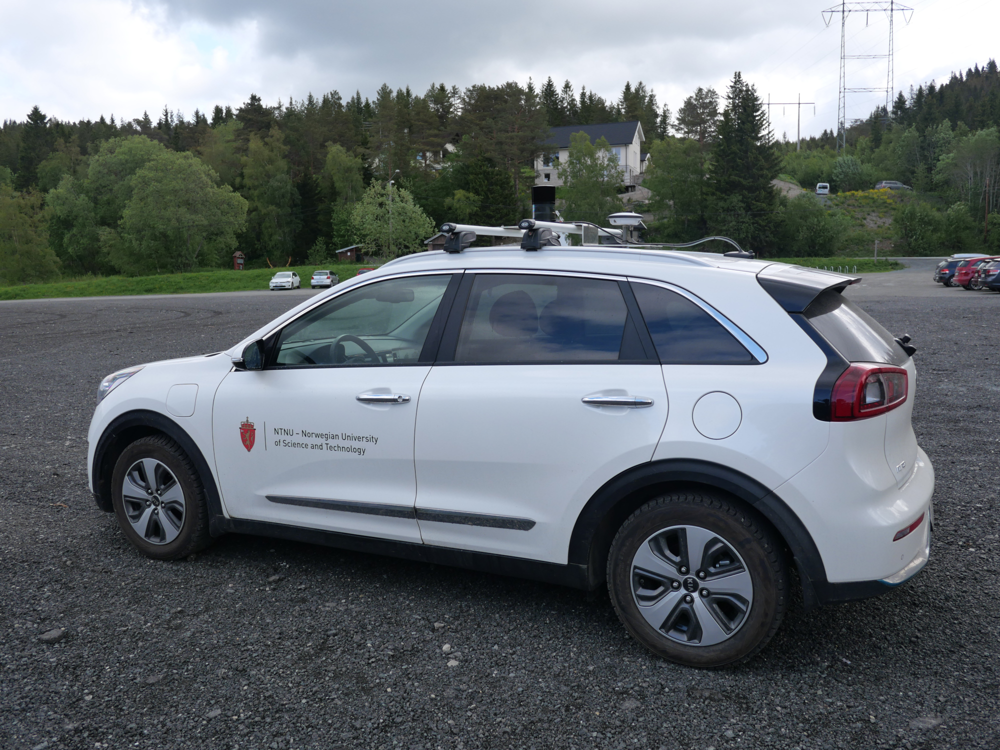
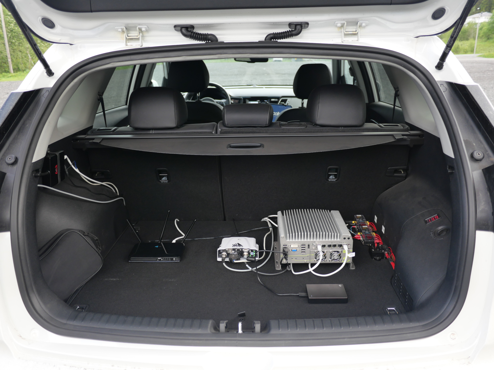

# Mechanical Platform

## Car

The autonomous car used at NAPLab is built upon a white hybrid KIA Niro model from 2018. It also has nice stickers that show its link to NTNU.

## LIDAR & GNSS Antenna Mount

It is equipped with an aluminium plate on which the HESAI Pandora and the GNSS Antenna are screwed at a fixed position. This plate is held to the car using car roof racks. 

In an HD map acquisition context \(more details on this in the software part\),  two LIDARs would need to be mounted on the car. The plate was made slightly longer than necessary to offer enough space for the VLP16 to be attached somewhere in front of the HESAI Pandora.

## Trunk components

A variety of other components are placed inside the trunk of the car. Movable components are all held to the trunk using velcro tape for convenience. Our GNSS Receiver/IMU, the PwrPak7 should always be mounted precisely at the same position and angle, it has then been screwed to the trunk.

